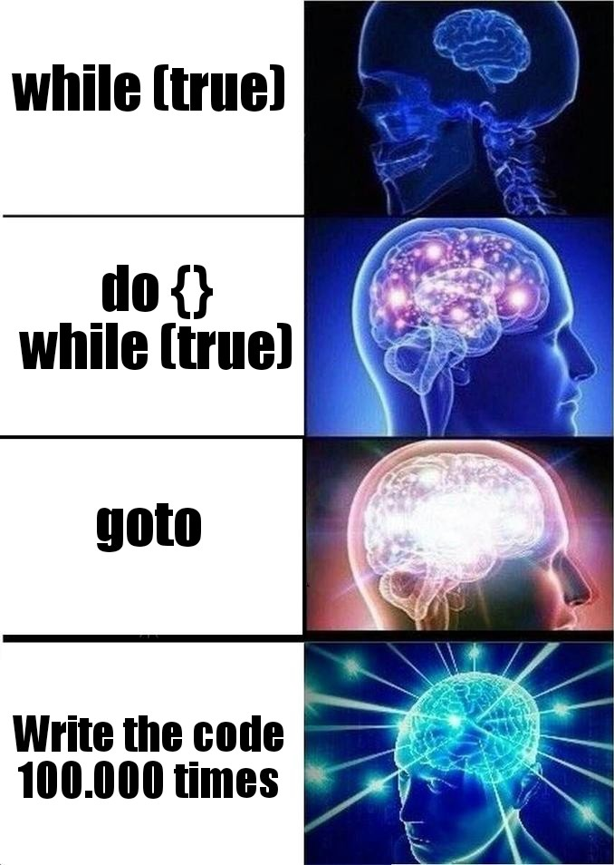

# Salman Navroz's Github Page
## Background
My name is **Salman Navroz** and I am based in **San Diego, California**. I currently attend **UC San Dieg**o. I like to program in my free time and work on innovative projects.

> Sometimes when you innovate, you make mistakes. It is best to admit them quickly, and get on with improving your other innovations.
- Steve Jobs
  
## Fun Things

Here is an infinite loop. Always remember the break statement unless you want to rip your hair out.
'''
    while (true) {
        System.out.println("I am infinite");
    }
'''

Here is a fun project I did a few years ago: [Gravity Ball](https://github.com/salnav/GravityBall).

My favorite programming is... [(top secret info)](language.md)

My favorite book is _The Pragmatic Programmer_

## Plans

### Long Term Plans
1. Finish School
2. Get a Job in Tech
3. Work on the next big thing!

### Short Term Plans
- [] Contribute to open source projects.
- [] Finish all the projects I have started.
- [x] Start learning deep learning.

### Day to Day Plans
* Get good grades this quarter.
* Exapnd software engineering knowledge.
* Progress on deep learning models.

